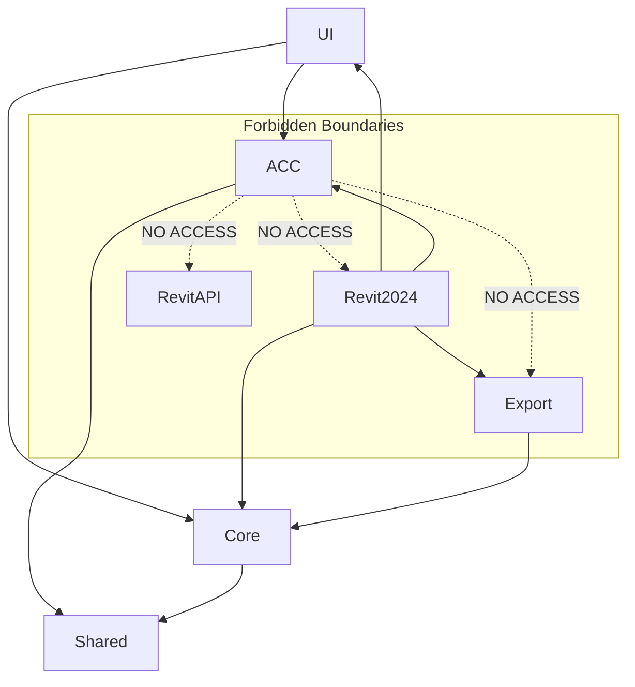

# SAUDICO Federate: The Master Mind Document
**Version:** 1.1.0-rc1 (Release Candidate)  
**Classification:** Internal Engineering & Operations Handbook  
**Scope:** Architecture, Workflow, Security, Deployment, and Handover  
**Date:** October 2024  
**Repository:** https://github.com/ahmed3bdelaziz/SAUDICO.Federate

---

## 📑 Table of Contents
1. [Executive Summary](#1-executive-summary)
2. [System Architecture](#2-system-architecture)
3. [Detailed Workflow Engine](#3-detailed-workflow-engine)
4. [ACC Integration & Authentication](#4-acc-integration--authentication)
5. [Data Model & State Management](#5-data-model--state-management)
6. [Security & Safety Guarantees](#6-security--safety-guarantees)
7. [Error Handling & Diagnostics](#7-error-handling--diagnostics)
8. [Deployment & Configuration](#8-deployment--configuration)
9. [Maintenance & Extension Guide](#9-maintenance--extension-guide)
10. [ISO 19650 Alignment](#10-iso-19650-alignment)
11. [Release Notes & Changelog](#11-release-notes--changelog)
12. [Troubleshooting & Support](#12-troubleshooting--support)

---

## 1. Executive Summary

**SAUDICO Federate** is a production-grade, automated Navisworks Cache (NWC) export engine designed for enterprise-scale BIM coordination. It operates as a Revit Add-in that decouples the **coordination export process** from the **authoring workflow**, ensuring that NWC generation is repeatable, auditable, and strictly read-only.

### 1.1 Core Value Proposition
- **Hybrid Source Support:** Unified handling of Local Files, Workshared Central Files, and Autodesk Construction Cloud (ACC) models.
- **Strict Isolation:** The ACC authentication module is architecturally forbidden from referencing the Revit API, ensuring security and modularity.
- **Deterministic Exports:** Uses a "Clean Room" temporary view strategy to guarantee consistent geometry output regardless of user view states.
- **Fail-Safe Operations:** Implements atomic file operations, exception containment, and rigorous cleanup to prevent data loss or model corruption.

### 1.2 Key Features
- ✅ **Multi-Source:** Local RVT, File-Central, ACC Cloud Models.
- ✅ **ACC Integration:** PKCE OAuth2, recursive browsing, verified cloud resolution.
- ✅ **Read-Only Safety:** Guaranteed no save, sync, publish, or relinquish.
- ✅ **Batch Processing:** Queue multiple models for unattended sequential export.
- ✅ **Audit Trail:** Detailed CSV logs and source integrity reports.
- ✅ **Cross-Version:** Supports Revit 2024 (.NET 4.8) and Revit 2025 (.NET 8.0).

---

## 2. System Architecture

The solution employs a **Layered Hexagonal Architecture** adapted for the constraints of the Revit API execution model.

### 2.1 Solution Structure
```text
SAUDICO.Federate.sln
├── src/
│   ├── Core/                  # [Domain Layer] Pure C# logic, no Revit UI refs
│   │   ├── Models.cs          # Job, SourceKind, ExportSettings DTOs
│   │   ├── Services.cs        # Opener (Document Opening Strategy)
│   │   └── SourceIntegrity.cs # File hash/timestamp validation
│   │
│   ├── Export/                # [Application Layer] Revit API Implementation
│   │   ├── Engine.cs          # Main Orchestrator (The "Runner")
│   │   ├── ViewBuilder.cs     # Temporary View Creation & Visibility Logic
│   │   └── NwcExporter.cs     # NavisworksExportOptions configuration
│   │
│   ├── SAUDICO.Federate.ACC/  # [Infrastructure Layer] ACC/PKCE Auth
│   │   ├── Authentication/    # OAuth2 PKCE Flow
│   │   ├── Tokens/            # DPAPI Encryption/Storage
│   │   └── DataManagement/    # ACC REST API Clients
│   │   ⚠️ CONSTRAINT: NO references to RevitAPI.dll
│   │
│   ├── UI/                    # [Presentation Layer] WPF
│   │   ├── Manager.xaml       # Main Batch Queue Window
│   │   └── ViewModels/        # MVVM Pattern
│   │
│   ├── Revit2024/             # [Host Layer] .NET 4.8 Entry Point
│   ├── Revit2025/             # [Host Layer] .NET 8.0 Entry Point
│   └── Shared/                # Cross-cutting concerns (Logging, Extensions)
│
├── tests/                     # Unit Tests (xUnit)
└── config/                    # Default Configuration Templates
```

### 2.2 Dependency Graph


**Critical Constraint:** The `SAUDICO.Federate.ACC` project must **never** reference `RevitAPI.dll`, `RevitAPIUI.dll`, or any project that does. It communicates via pure POCO (Plain Old CLR Objects) DTOs.

### 2.3 Threading Model
The application operates across three distinct thread contexts. Strict adherence to boundary rules is mandatory.

| Context | Responsibility | Allowed APIs | Forbidden APIs |
| :--- | :--- | :--- | :--- |
| **WPF UI Thread** | Rendering Manager window, user input, queue visualization. | WPF, `System.Net.Http`, `ACC Module` | `Autodesk.Revit.DB`, `UIApplication`, `Document` |
| **Background Thread** | HTTP requests, JSON parsing, File I/O (Logs/Config), Token Refresh. | `ACC Module`, `System.IO`, `Serilog` | `Autodesk.Revit.DB`, `ExternalEvent.Raise` (directly) |
| **Revit API Thread** | All interactions with the Revit Model. Executed via `IExternalEventHandler`. | `Autodesk.Revit.DB`, `Export`, `Core` | Long-running HTTP, Blocking I/O, WPF Controls |

---

## 3. Detailed Workflow Engine

The core logic resides in `src/Export/Engine.cs`. This is a state-machine-driven pipeline.

### Phase 1: Pre-Flight Validation
*   **Input:** `Job` object containing `SourceKind`, `Path/Descriptor`, `Settings`.
*   **Integrity Check (File Only):**
    *   If `SourceKind == LocalFile` or `FileCentral`: Capture `SourceFileSnapshot` (Size, LastWriteTime).
    *   If `SourceKind == AccCloudModel`: Set `IntegrityStatus = NotApplicableCloudSource`. Skip file system checks.
*   **Exporter Check:** Call `OptionalFunctionalityUtils.IsNavisworksExporterAvailable()`. If false, fail immediately.

### Phase 2: Document Opening (Strategy Pattern)
Executed in `src/Core/Services.cs` (`Opener.Open`).

| Source Kind | OpenOptions Configuration | Workset Config | Critical Safety |
| :--- | :--- | :--- | :--- |
| **LocalFile** | Default | N/A | None |
| **FileCentral** | `DetachFromCentralOption.DetachAndPreserveWorksets` | `OpenAllWorksets` | Ensures local detached copy; never syncs. |
| **AccCloudModel** | `DetachFromCentralOption.DoNotDetach` | `OpenAllWorksets` | **MUST** use `ModelPathUtils.ConvertCloudGUIDsToCloudPath`. |

*   **Result:** Returns an open `Document` object.
*   **Error Handling:** Any exception here triggers `job.Fail()` and skips to Cleanup.

### Phase 3: "Clean Room" View Creation
Executed in `src/Export/ViewBuilder.cs`.

1.  **Transaction Start:** `new Transaction(doc, "SAUDICO Temporary View")`.
2.  **View Cloning:** `View3D.CreateIsometric(doc, defaultViewTypeId)`.
3.  **Standardization:**
    *   `DetailLevel = Fine`
    *   `Discipline = Coordination`
    *   `CropBoxActive = false`
    *   `Underlay = None`
4.  **Visibility Logic (Denylist Approach):**
    *   **Global Annotation Hiding:** **DISABLED**. (Runtime evidence shows this causes "No Geometry" errors in NWC exporter).
    *   **Analytical Models:** `view.AreAnalyticalModelCategoriesHidden = settings.ExcludeAnalytical`.
    *   **Imported CAD:** `view.AreImportCategoriesHidden = !settings.IncludeLinkedCad`.
    *   **Specific Categories:** Iterate known problematic categories (e.g., `OST_RoomSeparationLines`). If `view.CanCategoryBeHidden(id)`, then `view.SetCategoryHidden(id, true)`.
    *   **Model Curves:** Explicitly find `CurveElement` where `CurveElementType == ModelCurve`. If `CanBeHidden`, call `view.HideElements(ids)`.
    *   **Worksets:** Iterate all `UserWorksets`. Force `view.SetWorksetVisibility(ws.Id, Visible)`.
5.  **Regenerate:** `doc.Regenerate()`.
6.  **Commit:** Transaction Commit.
7.  **Return:** `View3D` object.

### Phase 4: NWC Export Configuration
Executed in `src/Export/NwcExporter.cs`.

**Valid `NavisworksExportOptions` Properties Only:**
```csharp
options.ExportScope = NavisworksExportScope.View;
options.ViewId = temporaryView.Id;
options.Coordinates = settings.Coordinates; // Shared vs Project
options.DivideFileIntoLevels = settings.DivideFileIntoLevels;
options.ExportLinks = settings.IncludeLinks;
options.ConvertLinkedCADFormats = settings.IncludeLinkedCad;
options.FacetingFactor = settings.FacetingFactor; // Default 1.0
options.ExportElementIds = true;
options.ConvertElementProperties = true;
```

### Phase 5: Atomic File Operation
1.  **Temp Path:** Generate unique filename `__SAUDICO_TEMP_{guid}.nwc`.
2.  **Export:** `doc.Export(folder, tempName, options)`.
3.  **Validation:** Check `File.Exists(tempPath)` and `Length > 0`.
4.  **Final Path:** Construct destination `ModelName.nwc`.
5.  **Atomic Move:**
    *   If destination exists: Create backup → Move Temp to Dest → Delete Backup.
    *   If destination missing: Move Temp to Dest.

### Phase 6: Exception-Safe Cleanup
Executed in `finally` block of `Engine.Run`.
```csharp
Exception primaryError = null;
Exception cleanupError = null;

try { /* Run Phases 1-5 */ } 
catch (Exception ex) { primaryError = ex; } 
finally {
    try {
        if (doc != null && doc.IsValidObject) {
            doc.Close(false); // CRITICAL: Never save
        }
    } catch (Exception ex) { cleanupError = ex; }
}

if (primaryError != null) throw primaryError;
if (cleanupError != null) Log.Warning("Cleanup failed", cleanupError);
```

---

## 4. ACC Integration & Authentication

### 4.1 Authentication Flow (PKCE)
1.  **Generate:** `PkceService` creates `code_verifier` (random string) and `code_challenge` (SHA256 hash).
2.  **Authorize:** Open browser to `https://developer.api.autodesk.com/authentication/v2/authorize`.
3.  **Listen:** `LocalOAuthCallbackListener` starts HTTP listener on port 8080.
4.  **Callback:** Browser redirects to localhost with `code` and `state`.
5.  **Token Exchange:** POST to `/token` with `grant_type=authorization_code` + `code_verifier`.
6.  **Storage:**
    *   `access_token`: Stored in memory (volatile).
    *   `refresh_token`: Encrypted via `ProtectedData.Protect` (DPAPI) and saved to disk.

### 4.2 Cloud Model Resolution
1.  **Browse:** User selects folder in ACC via UI (calls ACC Data Management API).
2.  **Resolve:** Extract `ProjectGuid` and `ModelGuid` from ACC Item ID. Map to Revit Cloud Path.
3.  **Validate:** Before opening, verify the resolved path matches the expected identity.

### 4.3 Isolation Boundary
The `SAUDICO.Federate.ACC` assembly exports only DTOs (`AccCloudDescriptor`) and Interfaces (`IAccAuthenticationService`). It **never** knows about `Document`, `View`, or `Transaction`.

---

## 5. Data Model & State Management

### 5.1 The `Job` Object
```csharp
public class Job {
    public Guid Id { get; set; }
    public SourceKind SourceKind { get; set; } // Enum: Local, Central, AccCloud
    
    // Mutually Exclusive Sources
    public string LocalFilePath { get; set; }
    public AccCloudDescriptor CloudDescriptor { get; set; }
    
    public string OutputFolder { get; set; }
    public ExportSettings Settings { get; set; } // Frozen snapshot
    
    public JobState State { get; set; } // Queued, Running, Success, Failed
    public DateTime? StartTime { get; set; }
    public DateTime? EndTime { get; set; }
    
    // Diagnostics
    public string ErrorMessage { get; set; }
    public SourceIntegrityStatus IntegrityStatus { get; set; }
}
```

### 5.2 Export Settings (Frozen Snapshot)
Settings are cloned at job creation to ensure batch consistency.
*   `IncludeLinks` (bool)
*   `DivideFileIntoLevels` (bool)
*   `Coordinates` (Enum: Shared, Project)
*   `FacetingFactor` (double)
*   `ExcludeAnalytical` (bool)
*   `ExcludeAnnotations` (bool - *Flagged as No-Op*)

---

## 6. Security & Safety Guarantees

### 6.1 Read-Only Enforcement
*   **Code Scan:** CI pipeline fails if `Document.Save`, `SaveAs`, `SynchronizeWithCentral`, `Publish`, or `RelinquishOwnership` are detected.
*   **Runtime:** All documents opened with `Close(false)`.
*   **Transaction Scope:** Limited to creating/deleting the temporary view. No model elements modified.

### 6.2 Token Security
*   **Encryption:** Refresh tokens encrypted using Windows DPAPI (`CurrentUser` scope).
*   **Memory:** Access tokens exist only in RAM.
*   **Rotation:** Refresh tokens rotated on every use.

### 6.3 File System Safety
*   **Atomic Writes:** Prevents corruption during power loss.
*   **Overwrite Policy:** Existing NWC files backed up before replacement.
*   **Temp Cleanup:** Temporary files deleted immediately after successful move.

---

## 7. Error Handling & Diagnostics

### 7.1 Containment
Errors are caught at the **Job Level**. A failure in Job A does not stop Job B.
```csharp
foreach (var job in queue) {
    try { engine.Run(job); } 
    catch (Exception ex) {
        job.State = Failed;
        job.ErrorMessage = ex.Message;
        Log.Error(ex, "Job {JobId} failed", job.Id);
    }
    csvWriter.Write(job); // Always log result
}
```

### 7.2 Diagnostic Logging
*   **Serilog:** Structured logging to `%APPDATA%\SAUDICO\Federate\logs\app.log`.
*   **Redaction:** Automatically scrubs tokens, emails, and full cloud paths.
*   **Context:** Every log entry includes `JobId`, `SourceKind`, and `RevitVersion`.

### 7.3 Dialog Suppression
*   **Whitelist:** Only specific known dialog IDs are auto-dismissed.
*   **Fail-Safe:** Unknown dialogs cause the job to fail safely.

---

## 8. Deployment & Configuration

### 8.1 Installation
*   **Script:** `INSTALL-ALL.ps1` copies binaries to `%APPDATA%\Autodesk\REVIT\Addins\[Year]`.
*   **Manifest:** `.addin` file points to the correct DLL based on Revit version.

### 8.2 Configuration Files
Located in `%APPDATA%\SAUDICO\Federate\config\`:
*   `apssettings.json`: Client ID, Scopes, Endpoints. (Managed by Admin).
*   `settings.json`: User-specific export defaults.
*   `aps-token.dat`: Encrypted auth tokens. (Auto-generated).

### 8.3 Versioning
*   **AssemblyVersion:** `1.1.0.0`
*   **FileVersion:** `1.1.0.rc1`
*   **CI/CD:** Automated build increments build number; manual tag creates release.

---

## 9. Maintenance & Extension Guide

### 9.1 Adding a New Revit Version (e.g., 2026)
1.  Copy `src/Revit2025` folder to `src/Revit2026`.
2.  Update `.csproj` to target new Revit API references.
3.  Update `Directory.Build.props` to include new configuration.
4.  Verify `IExternalApplication` implementation.

### 9.2 Modifying Visibility Rules
1.  Edit `src/Export/ViewBuilder.cs`.
2.  **Do not** add global category hides without testing in Navisworks first.
3.  Prefer `HideElements` over `SetCategoryHidden` for specific exclusions.

### 9.3 Debugging
*   **Attach:** Visual Studio → Attach to Process → `Revit.exe`.
*   **Breakpoints:** Safe in `Core`, `Export`, and `Host`. **Unsafe** in WPF constructors if they access Revit objects.
*   **Logs:** Check `app.log` first for stack traces.

---

## 10. ISO 19650 Alignment

SAUDICO Federate supports ISO 19650 workflows by providing:
1.  **Traceability:** CSV logs link Output NWC to Input Source (File/Cloud Version).
2.  **Security:** Read-only enforcement prevents unauthorized modification of the "Shared Information Container".
3.  **Consistency:** Standardized view templates ensure geometric fidelity across disciplines.
4.  **Auditability:** Complete record of success/failure for every information container processed.

*Note: Full compliance requires project-specific configuration of naming conventions and approval workflows outside the scope of this tool.*

---

## 11. Release Notes & Changelog

### [1.1.0-rc1] - 2024
#### 🎉 Major Features
- **ACC Cloud Integration:** Full PKCE auth, browsing, and cloud model export.
- **Source Abstraction:** Unified `Job` model for Local, Central, and Cloud.
- **Enhanced Logging:** Structured Serilog with sensitive data redaction.

#### 🔧 Fixes & Improvements
- **Revit API Compliance:** Corrected `NavisworksExportOptions`, fixed `DivideFileIntoLevels`.
- **Annotation Safety:** Removed unsafe global annotation hiding.
- **Error Handling:** Preserved primary exceptions even if `Close(false)` fails.
- **Threading:** Verified WPF UI thread safety.

#### 🔒 Security
- **CI Hardening:** Replaced "No ACC" check with "ACC Isolation" validation.
- **Data Privacy:** Redacted tokens and PII from logs.

#### 📝 Known Issues
- **Annotation Exclusion:** Currently a no-op to prevent geometry loss.
- **Revit 2024 Cloud:** Ensure cloud models are not upgraded to 2025 format.

### [1.0.8] - Previous Stable
- Local and File-Central support only.
- Basic NWC export without ACC integration.

---

## 12. Troubleshooting & Support

### Common Issues
| Issue | Possible Cause | Solution |
| :--- | :--- | :--- |
| **"No Geometry" in NWC** | Annotation hiding enabled | Disable "Exclude Annotations" in settings. |
| **Auth Loop** | Invalid Redirect URI | Verify `http://localhost:8080` in APS dashboard. |
| **Export Fails** | Navisworks Exporter missing | Reinstall Revit with Navisworks tools. |
| **Cloud Model Fail** | Region Mismatch | Verify Hub region matches Revit login. |

### Support Contacts
- **Logs:** `%APPDATA%\SAUDICO\Federate\logs\app.log`
- **CSV Reports:** Located in the output folder (`export_log.csv`)
- **Internal Support:** Contact BIM Technology Lead with logs attached.

---
*End of Master Mind Document. Approved for Distribution.*
